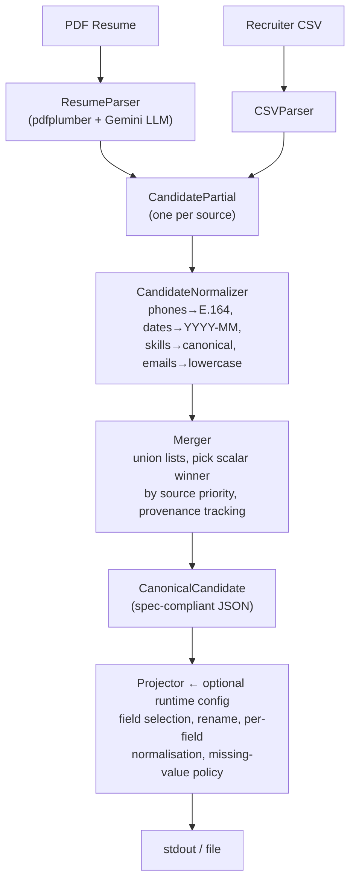

# Eightfold Multi-Source Candidate Data Transformer

Turns messy, multi-source candidate inputs into one clean, canonical JSON profile.

**Sources supported:** Resume PDF + Recruiter CSV (one structured, one unstructured).

---

## Quick start

```bash
# 1. Install dependencies
pip install -r requirements.txt

# 2. Set your Gemini API key (for resume PDF parsing)
export GOOGLE_API_KEY="your-key-here"
# OR create a .env file:  GOOGLE_API_KEY=your-key-here

# 3. Run — resume + CSV, default schema
python main.py --resume path/to/resume.pdf --csv path/to/candidates.csv

# 4. Run with a custom projection config
python main.py --resume path/to/resume.pdf --csv path/to/candidates.csv \
               --config config/config_example.json

# 5. Save output to a file
python main.py --resume path/to/resume.pdf --csv path/to/candidates.csv \
               --output output.json

# 6. Verbose logging
python main.py --resume path/to/resume.pdf --log-level INFO
```

---

## Architecture

---

## Output schema (default)

| Field                | Type                                    | Notes                     |
|----------------------|-----------------------------------------|---------------------------|
| `candidate_id`       | string                                  | SHA-256 hash (16 chars)   |
| `full_name`          | string \| null                          |                           |
| `emails`             | string[]                                |                           |
| `phones`             | string[]                                | E.164 format              |
| `location`           | `{city, region, country}`               | country: ISO-3166 alpha-2 |
| `links`              | `{linkedin, github, ...}`               |                           |
| `headline`           | string \| null                          |                           |
| `years_experience`   | number \| null                          | computed from dates       |
| `skills`             | `[{name, confidence, sources[]}]`       | canonical names           |
| `experience`         | `[{company,title,start,end,summary}]`   | YYYY-MM dates             |
| `education`          | `[{institution,degree,field,end_year}]` |                           |
| `provenance`         | `[{field, source, method}]`             |                           |
| `overall_confidence` | number                                  | 0–1                       |

---

## Runtime config (configurable output)

Create a JSON config to reshape the output without changing any code:

```json
{
  "fields": [
    {
      "path": "full_name",
      "type": "string",
      "required": true
    },
    {
      "path": "primary_email",
      "from": "emails[0]",
      "type": "string"
    },
    {
      "path": "phone",
      "from": "phones[0]",
      "type": "string",
      "normalize": "E164"
    },
    {
      "path": "skills",
      "from": "skills[].name",
      "normalize": "canonical"
    }
  ],
  "include_confidence": true,
  "on_missing": "null"
}
```

**Path syntax:**

- `full_name` -> scalar field
- `emails[0]` -> first element of a list
- `skills[].name` -> pluck a sub-field from every list element
- `location.city` -> nested field

**`on_missing`:** `"null"` | `"omit"` | `"error"`

---

## Merge / conflict-resolution policy

| Field type                         | Policy                                                   |
|------------------------------------|----------------------------------------------------------|
| Scalars (name, headline, location) | Resume wins over CSV (higher source priority)            |
| Lists (emails, phones)             | Union across all sources, deduplicated                   |
| Skills                             | Union; confidence boosted when seen in multiple sources  |
| Experience                         | Resume entries preferred; CSV adds only new companies    |
| Education                          | Resume entries preferred; CSV adds only new institutions |

---

## Edge cases

| Case                            | Handling                                                    |
|---------------------------------|-------------------------------------------------------------|
| Missing / empty PDF             | Returns empty LLMResponse; pipeline continues with CSV data |
| LLM API error                   | Logged; returns empty partial — never crashes               |
| Unparseable phone               | Logged and excluded; never coerced                          |
| Unknown date format             | Set to null; never guessed                                  |
| CSV missing columns             | Silently skipped; column presence is optional               |
| Duplicate skills across sources | Merged by canonical name; confidence boosted                |
| No GOOGLE_API_KEY set           | Warning logged; resume parser returns nulls                 |

---

## Assumptions and descoped items

- Only one candidate per run (pipeline takes a single CSV row by index).
- GitHub / LinkedIn parsers are not implemented (out of scope for CSV+PDF inputs).
- Skill confidence is heuristic (0.75–0.93), not ML-derived.
- Location geocoding uses a lookup table; no external geocoding API is called.
